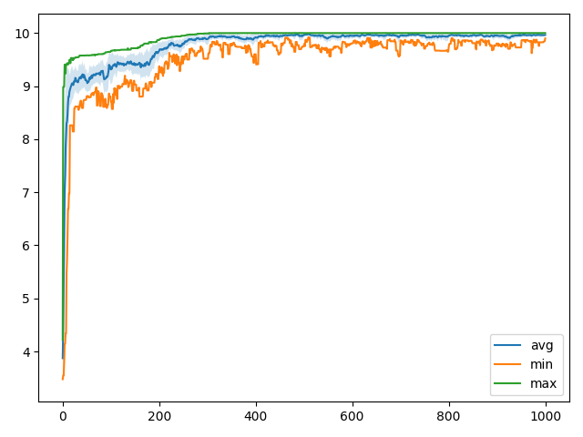

The details of implementation:
* Roulette selection,
* Blend crossover,
* Creep mutation with gaussian steps, the parameters are included into a chromosome and evolve along with the solution.

Works even for the shifted objective function (for example, `f(x-0.5)`).

Optimization log:
