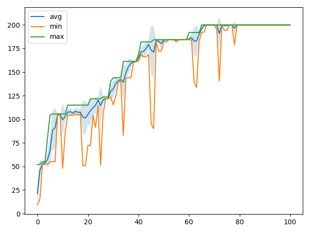
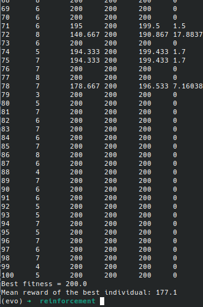

# Lab 2: Reinforcement learning with GA

**Details of the implementation**:
* Tournament (with size = 3) selection,
* Creep mutation with gaussian steps,
* Parameter-wise two point crossover.

**Optimization log**:  

**Evaluation result**:  
